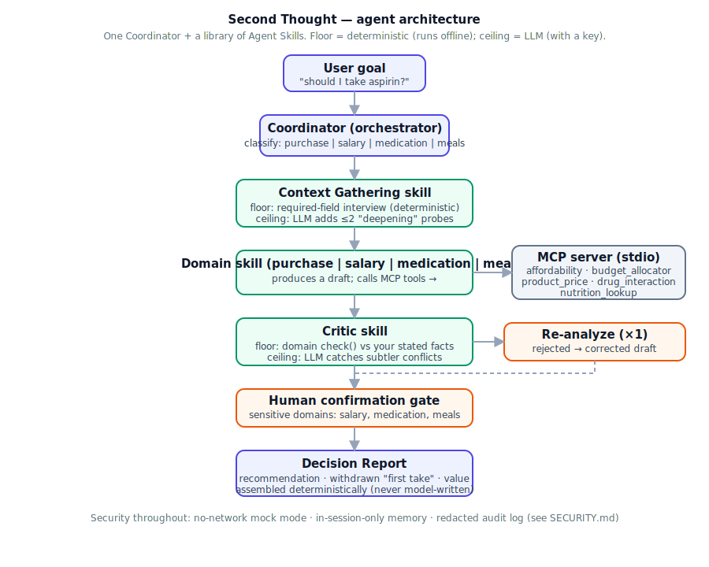

# Second Thought

*A decision concierge that thinks twice.*

**Track:** Concierge Agents — Kaggle "AI Agents: Intensive Vibe Coding Capstone"

> **Most AI agents rush to agree. This one interviews you first, then argues
> with its own recommendation before giving it to you.**
>
> Second Thought refuses to answer until it understands your situation, then
> runs a deterministic self-check that can catch — and correct — its own bad
> advice before you ever see it. Hence the name: it gives an answer, then has
> a second thought.
>
> And when you push back — *"just say yes"* — it **holds its ground** and cites
> the fact it's anchored in. It caves to new information, never to pressure.

## Problem

LLMs are sycophantic: ask "should I buy this?" and you get an instant, agreeable,
context-free "yes." The model never asked your budget, never checked its own
recommendation against what you actually said you need, and treats a purchase
question and a financial-planning question identically. For decisions with money
or risk on the line, "confidently agreeable" is the wrong default.

## Solution

Second Thought is a single orchestrator agent backed by a **library of
Agent Skills**, not a hand-built agent per domain. Four domains ship today —
**purchase**, **salary**, **medication**, and **meals** — spanning the big
occasional decisions *and* the small everyday ones. Adding a fifth means adding
one skill folder + one line in `DOMAIN_SKILL`, not a new agent.

The domains aren't separate features — they're the same behavior fired in
different places: **catch the moment you're about to betray something you
already told the agent you wanted.** `meals` is that behavior at its most
everyday — "you said you're cutting sugar; this smoothie is 52g" — and it uses
a different deterministic check shape (a threshold/diet-tag test against your
stated goal, not a table lookup), proving `check()` generalizes.

The **medication** domain is the sharpest demonstration of the hook — and the
most on-track for Concierge ("helping manage complicated medications"). It
checks a candidate medication/supplement, **for you or a family member you care
for**, against the *stated allergies and current meds*, and when a first take
glosses over a conflict, the deterministic floor catches it ("Candidate matches
a stated allergy: aspirin") and withdraws it. It is framed strictly as a
preparation/organizer aid — **not medical advice** — and is gated behind human
confirmation like all sensitive domains.



**Privacy is a first-class constraint** (the Concierge track's defining
requirement): sensitive data never leaves your machine in mock mode, nothing
sensitive is persisted, the audit log is redacted, and sensitive decisions
require human confirmation. Full mapping of protections to code in
[SECURITY.md](SECURITY.md).

```
User goal
   │
   ▼
Coordinator (orchestrator.py) ── classifies domain: purchase | salary | medication | meals
   │
   ▼
Context Gathering skill ── floor: interview each required field (deterministic)
   │                        ceiling: LLM may add ≤2 "deepening" probes (with a key)
   ▼
Domain skill (purchase_analysis | salary_planning) ── calls MCP tools for
   │                                                    deterministic math/lookups
   ▼
Critic skill ── floor: deterministic contradiction check vs stated facts
   │             ceiling: LLM catches subtler conflicts (with a key)
   │
   ├── rejected? ──► Re-analyze: domain skill re-runs with the critique
   │                 injected, produces a corrected draft (capped at 1 retry)
   ▼
[sensitive domain? → human confirmation gate]
   │
   ▼
Report skill ── assembles the final Decision Report (templated, not model-written)
```

The **floor/ceiling** split is what makes the self-correction real *and*
offline-demoable: the deterministic floor catches obvious contradictions
(e.g. a pick priced over your budget) with no API key, and an LLM ceiling adds
nuance when a key is present.

### Challenge-back: it won't be talked out of the truth

After the report, you can push back. `orchestrator.challenge()` distinguishes
**pressure** from **new information**:

- *"just say yes, I really want it"* → **holds**, and cites the exact fact the
  recommendation is anchored in. It does not flip to please you.
- *"actually my budget is now $3000"* → a genuinely new fact → it re-runs the
  decision honestly (the over-budget conflict disappears, and it recommends the
  buy). Same floor/ceiling pattern: a deterministic extractor for the common
  case, an LLM extractor for the rest; default is to change nothing.

This closes the anti-sycophancy loop — the agent argues with *itself*, and also
refuses to fold when *you* lean on it.

## Course concepts → where to find them (for judges)

The rubric asks for at least three course concepts. This repo demonstrates all
six — here's the exact location of each, mirroring the rubric's own checklist.

| Rubric concept | Where | In this repo |
|---|---|---|
| **Agent / Multi-agent system (ADK)** | Code | `adk_app/agent.py` — a Google ADK coordinator with four domain sub-agents, delegating over the same MCP server (`adk web` / `adk run adk_app`). The hand-written coordinator lives in `decision_concierge/orchestrator.py`. |
| **MCP Server** | Code | `decision_concierge/mcp_server/server.py` — a real `FastMCP` stdio server exposing five tools; `mcp_client.py` calls it (with an in-process fallback). |
| **Agent Skills** | Code | `decision_concierge/skills/*/` — each skill is a folder with a `SKILL.md` (frontmatter + system-instruction body) and `skill.py`; `skills/__init__.py` is the registry (progressive disclosure). |
| **Security features** | Code | `decision_concierge/security.py` — sensitive-domain human-confirmation gate + redacted audit log (raw income/meds never hit disk). |
| **Antigravity** | Video | Built agent-first in Google Antigravity (video scene S7). |
| **Deployability** | Video | Live, public, no login: **second-thought.streamlit.app** — reproduce via the `## Deploy` section below. |

## How this maps to the 5-day course

| Day | Concept | Where |
|---|---|---|
| 1 | Agent loop (perceive → plan → act → observe), context engineering | `orchestrator.py`, `memory.py` |
| 2 | MCP (tools as USB-C), NxM problem | `decision_concierge/mcp_server/server.py` (real MCP server), `mcp_client.py` |
| 3 | Agent Skills, progressive disclosure | `decision_concierge/skills/*/SKILL.md` + `skills/__init__.py` registry |
| 4 | Human-in-the-loop, least-privilege, audit trail | `security.py` (confirmation gate + redacted audit log) |
| 5 | Spec-driven structure, disposable code / durable spec | This README + `SKILL.md` files are the spec; skill implementations are swappable |

At least 3 concepts required by the rubric — this hits all 5 by design, not padding.

## Why agents (not a single prompt)

The Context Gathering skill can't know in advance whether it's interviewing
for a purchase or a budget — it's a reusable skill triggered by whichever
domain skill needs it. The Critic skill runs regardless of domain and only
knows how to compare a draft against stated facts. None of the skills know
about each other; the Coordinator is the only thing that sequences them.
That's the orchestration story judges are asked to look for.

## Security notes

- No API keys in code — `GEMINI_API_KEY` read from `.env` (see `.env.example`).
- Salary domain is flagged `SENSITIVE_DOMAINS` in `config.py` — the report is
  gated behind an explicit human confirmation step before it's finalized.
- The audit log (`audit_log.jsonl`) redacts financial figures by key name
  before writing (`security.redact`), so raw income/expense numbers never
  hit disk.
- The MCP client has a same-process fallback: if the MCP subprocess or the
  `mcp` package isn't available, tool calls fall back to calling the same
  functions directly — the contract holds either way.

## Running it

```bash
python -m venv .venv
.venv\Scripts\activate        # Windows
pip install -r requirements.txt

cp .env.example .env           # then set GEMINI_API_KEY (optional — see below)

streamlit run app.py
```

Want the Google ADK entrypoint too (`adk web` / `adk run adk_app`)? Install the
extra deps on top: `pip install -r requirements-adk.txt`. It's kept separate so
the Streamlit Cloud deploy stays lean — `app.py` never imports ADK.

**No API key?** It still runs. `MOCK_MODE` kicks in automatically: the agent
loop, MCP tool calls, skill sequencing, and the confirmation gate all still
execute — only the natural-language phrasing and recommendation text fall
back to deterministic templates instead of Gemini-generated text.

Run the smoke tests (no API key required):

```bash
python -m pytest tests/ -v
```

## Deploy (Streamlit Community Cloud)

The app deploys as-is with **no secrets** — it runs in `MOCK_MODE`, so the
public demo is always-on, deterministic, and never hits an API quota:

1. Push to a public GitHub repo (this one).
2. Go to [share.streamlit.io](https://share.streamlit.io) → **New app** → sign in
   with GitHub.
3. Pick this repo, branch `main`, main file `app.py`.
4. Under **Advanced settings**, set Python to **3.12** (not 3.14).
5. Deploy. Streamlit Cloud installs `requirements.txt` (lean — no ADK) and
   serves a public URL.

To run the deployed app in **live mode** instead of mock, add `GEMINI_API_KEY`
under the app's **Settings → Secrets** (it is exposed to the app as an env var).
Mock mode is recommended for the public demo — no key, no rate limits.

## Project structure

```
app.py                          Streamlit UI (thin — renders orchestrator output)
decision_concierge/
  config.py                     env/model config, mock-mode fallback
  memory.py                     Session (in-memory, per-conversation context)
  security.py                   redaction, audit log, sensitive-domain gate
  orchestrator.py                Coordinator agent loop
  mcp_client.py                  MCP stdio client (+ in-process fallback)
  mcp_server/server.py           real MCP server: affordability_calculator,
                                  budget_allocator, product_price_lookup
  skills/
    context_gathering/           adaptive interview skill
    purchase_analysis/           purchase domain skill
    salary_planning/             salary domain skill
    critic/                      cross-checks drafts against stated facts
    report/                      final structured Decision Report (templated)
tests/test_smoke.py              end-to-end flow tests, both domains
```

## Known limitations / future work

- `product_price_lookup`, `drug_interaction_lookup`, and `nutrition_lookup` are
  small static, clearly-labeled mock tables — swap for real price/review,
  licensed drug-interaction (e.g. RxNorm/DrugBank), and nutrition (e.g. USDA
  FoodData Central) MCP servers in production.
- **The medication and meals domains are goal-alignment/organizer aids, not
  medical or nutrition advice.** They only check a choice against the user's
  *own stated* facts and goals (allergies, current meds, diet goal); they never
  diagnose, prescribe, or call a food healthy/unhealthy as fact.
- Four domains ship (Purchase, Salary, Medication, Meals) by design — adding a
  fifth is one `SKILL.md` + `skill.py` (with `run` + `check`) and one
  `DOMAIN_SKILL` line, not a restructure.
- No persistence across sessions (by design — sensitive facts live only in
  session memory, never written to disk unredacted).
